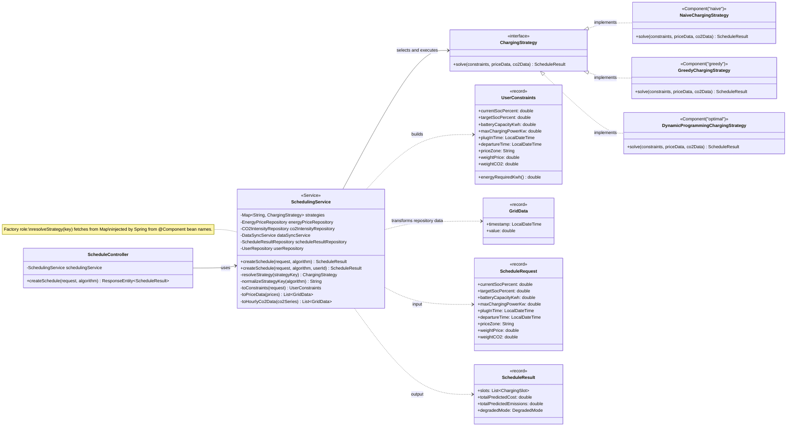

# Strategy and Factory Pattern Class Diagram

This diagram focuses on how scheduling algorithms are extended through Strategy and selected through a factory-like registry in the service layer.

## OCP proof point

`SchedulingService` depends on `ChargingStrategy` abstraction, not concrete algorithms. The current codebase already has three interchangeable implementations (`naive`, `greedy`, `optimal`). A future 4th algorithm (for example, `BalancedChargingStrategy`) can be added by implementing `ChargingStrategy` and registering it as a Spring component key, without changing core scheduling flow in `createSchedule(...)`.
